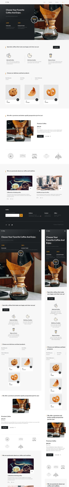

## DESCRIPTION:
- I cloned a mobile-first responsive website for a Cafe.
- [Youtube Video of the App](https://youtu.be/-TijNlW-7g8)

## OUTCOME:
- A Mobile first responsive website, with filtering products feature.
- link to the App's video on youtube: https://youtu.be/-TijNlW-7g8

## TECH STACKS:
- HTML
- CSS
- Library: 
    - Icons: BoxIcons.com
    - Filtering data: https://www.kunkalabs.com/mixitup/

## PROGRESS:
- Done: 100%.

## View other projects:
- [My Blog](https://hashnode.com/@marizoo)
- [My Pinterest](https://pin.it/16vGwjy)
- [My Youtube Channel](https://www.youtube.com/channel/UCfkbnM9WvHD3mjecBiGHCBQ/playlists)

## IMAGE:

